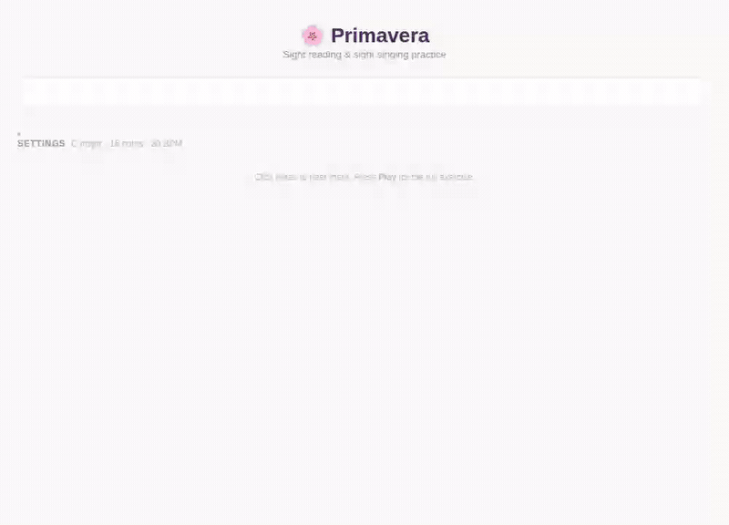

Primavera helps music students practice sight-reading and singing with real-time feedback.

## Why

I built Primavera while studying at SLAC Leuven. Preparing for sight-reading and singing tests meant either finding a patient practice partner or stumbling through exercises with no way to know if I was hitting the right notes. I wished something like this existed — so I made it.

## How it works

**Practice mode** generates random exercises rendered as sheet music by [abcjs](https://www.abcjs.net/). Click any note to hear it, or play the full exercise with note-by-note highlighting. Key signature, interval range, tempo, and length are all adjustable.

**Quiz mode** listens through your microphone and uses [pitchy](https://github.com/ianprime0509/pitchy) for real-time pitch detection. A tuning gauge shows how close you are to the expected note, and the exercise advances as you get each one right.

## Privacy

Primavera runs entirely in your browser. There is no backend, no account, no tracking. Pitch detection happens locally using the Web Audio API — your audio never leaves your device.

Free to use at [primavera.lightcone.be](https://primavera.lightcone.be).
